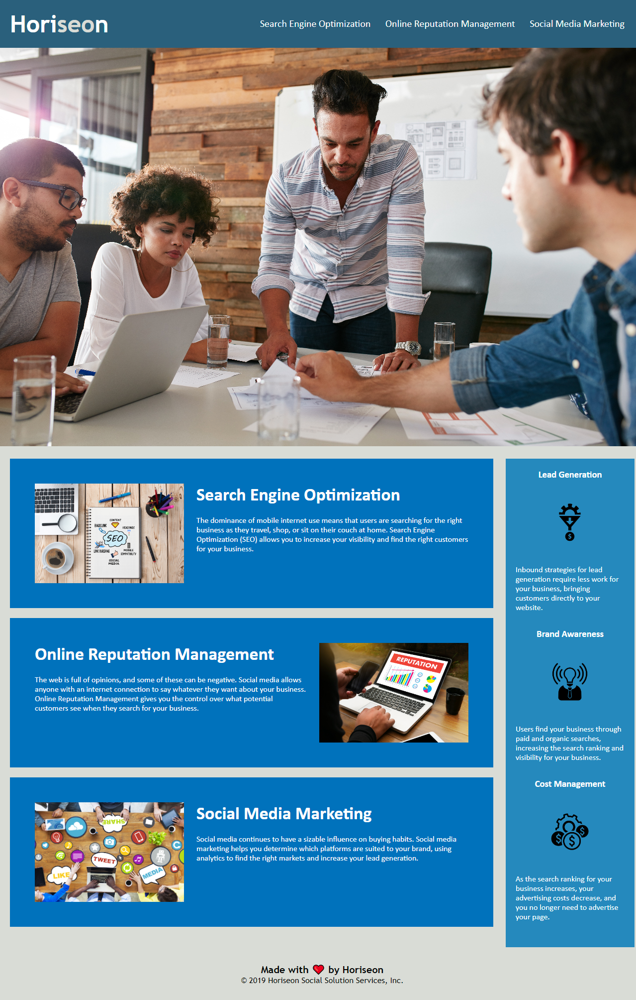

# Homework Week 1
## Horiseon Ticket

### User Story
```
AS A marketing agency
I WANT a codebase that follows accessibility standards
SO THAT our own site is optimized for search engines
```

### Acceptance Criteria
```
GIVEN a webpage meets accessibility standards
WHEN I view the source code
THEN I find semantic HTML elements
WHEN I view the structure of the HTML elements
THEN I find that the elements follow a logical structure independent of styling and positioning
WHEN I view the icon and image elements
THEN I find accessible alt attributes
WHEN I view the heading attributes
THEN they fall in sequential order
WHEN I view the title element
THEN I find a concise, descriptive title
```
### Work Description
Looked at main HTML and JS file and consolidated divisions that share identical properties. Eliminated multiple divisions are replaced with correct HTML Semantic headings. Comments on website structure and changes were made in both HTML and JS files to make show where changes were implemented. Fixed heading titles and re-organised elements in JS file to match HTML work flow making code easier to read side by side.

Gave all images in website alt attributes in case images fail to load or un accessible, also gave images size restraint as not to affect website viewing if images fail to load.

After completion website was compiled into GitHub and using GitPages is now accessible to the public.

>## [**Link to live GitPage**](https://lucienpep.github.io/Week-1-Homework/)



---
Lucien Haines UADL 2022
